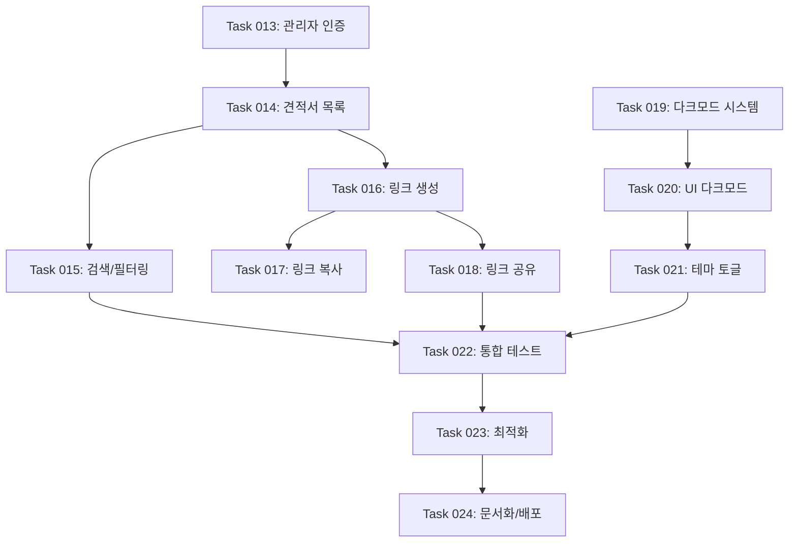

# 노션 기반 견적서 관리 시스템 고도화 개발 로드맵

노션을 데이터베이스로 활용한 견적서 관리 시스템의 고도화를 통해 관리자 경험과 사용자 편의성을 획기적으로 개선

## 개요

노션 기반 견적서 관리 시스템 고도화 프로젝트는 완성된 MVP를 기반으로 관리자와 클라이언트 모두에게 향상된 경험을 제공하는 고급 기능들을 추가합니다:

- **관리자 대시보드**: 발행한 모든 견적서를 한눈에 관리할 수 있는 통합 대시보드
- **링크 복사 기능**: 클라이언트에게 전달할 견적서 링크를 쉽고 빠르게 공유
- **다크모드 지원**: 사용자 선호에 따른 테마 전환으로 향상된 사용자 경험

## 개발 워크플로우

1. **작업 계획**
   - 기존 코드베이스를 학습하고 현재 상태를 파악
   - 새로운 작업을 포함하도록 `ROADMAP.md` 업데이트
   - 우선순위 작업은 마지막 완료된 작업 다음에 삽입

2. **작업 생성**
   - 기존 코드베이스를 학습하고 현재 상태를 파악
   - `/tasks` 디렉토리에 새 작업 파일 생성
   - 명명 형식: `XXX-description.md` (예: `013-admin-dashboard.md`)
   - 고수준 명세서, 관련 파일, 수락 기준, 구현 단계 포함
   - **API/비즈니스 로직 작업 시 "## 테스트 체크리스트" 섹션 필수 포함 (Playwright MCP 테스트 시나리오 작성)**
   - 예시를 위해 `/tasks` 디렉토리의 마지막 완료된 작업 참조. 예를 들어, 현재 작업이 `015`라면 `014`와 `013`을 예시로 참조.
   - 이러한 예시들은 완료된 작업이므로 내용이 완료된 작업의 최종 상태를 반영함 (체크된 박스와 변경 사항 요약). 새 작업의 경우, 문서에는 빈 박스와 변경 사항 요약이 없어야 함. 초기 상태의 샘플로 `000-sample.md` 참조.

3. **작업 구현**
   - 작업 파일의 명세서를 따름
   - 기능과 기능성 구현
   - **API 연동 및 비즈니스 로직 구현 시 Playwright MCP로 테스트 수행 필수**
   - 각 단계 후 작업 파일 내 단계 진행 상황 업데이트
   - 구현 완료 후 Playwright MCP를 사용한 E2E 테스트 실행
   - 테스트 통과 확인 후 다음 단계로 진행
   - 각 단계 완료 후 중단하고 추가 지시를 기다림

4. **로드맵 업데이트**
   - 로드맵에서 완료된 작업을 ✅로 표시

## 개발 단계

### Phase 5: 관리자 기능 구축 ✅

- **Task 013: 관리자 레이아웃 및 인증 시스템 구현** ✅ - 완료
  - ✅ 관리자 전용 레이아웃 컴포넌트 생성
  - ✅ 간단한 인증 시스템 구현 (환경변수 기반 패스워드)
  - ✅ 관리자 세션 관리 및 보호된 라우트 설정
  - ✅ 관리자 네비게이션 바 및 사이드바 구현

- **Task 014: 견적서 목록 페이지 구현** ✅ - 완료
  - ✅ Notion API를 통한 모든 견적서 데이터 조회
  - ✅ 테이블 형태의 견적서 목록 UI 구현
  - ✅ 견적서 상태, 클라이언트명, 발행일, 총액 표시
  - ✅ 페이지네이션 및 정렬 기능 구현

- **Task 015: 검색 및 필터링 기능 구현** ✅ - 완료
  - ✅ 클라이언트명, 견적서 번호 검색 기능
  - ✅ 상태별 필터링 (대기/승인/거절)
  - ✅ 날짜 범위 필터링
  - ✅ 검색 결과 하이라이팅

### Phase 6: 링크 관리 기능 ✅

- **Task 016: 고유 링크 생성 및 표시 시스템** ✅ - 완료
  - ✅ 각 견적서별 고유 URL 자동 생성 로직 (`lib/utils/link-generator.ts`)
  - ✅ 견적서 목록에 링크 컬럼 추가 (`components/admin/link-display.tsx`)
  - ✅ 짧은 URL 형식 지원 (`generateShortUrl` 함수)
  - QR 코드 생성 기능 (미구현 - 선택사항)

- **Task 017: 원클릭 링크 복사 기능** ✅ - 완료
  - ✅ 복사 버튼 컴포넌트 개발 (`components/admin/copy-button.tsx`)
  - ✅ 클립보드 API 활용한 복사 기능 (`hooks/use-clipboard.ts`)
  - ✅ 복사 성공/실패 토스트 알림 (sonner 사용)
  - ✅ 복사 버튼 호버 효과 및 툴팁 (Tooltip 컴포넌트)

- **Task 018: 링크 공유 통합 기능** ✅ - 완료
  - ✅ 이메일로 링크 전송 기능 (mailto 링크)
  - ✅ 텔레그램 공유 버튼 및 모바일 Web Share API 지원
  - ✅ 데스크톱/모바일 환경별 공유 UI 분기 처리
  - 링크 통계 추적 (미구현 - 선택사항)

### Phase 7: 다크모드 구현 ✅

- **Task 019: 다크모드 테마 시스템 구축** ✅ - 완료
  - ✅ next-themes 라이브러리 설정 (`components/providers/theme-provider.tsx`)
  - ✅ 다크모드 색상 팔레트 정의 (`globals.css` `.dark` 블록 OKLCH 색상)
  - ✅ CSS 변수 기반 테마 토큰 설정 (`@custom-variant dark`, `@theme inline`)
  - ✅ 시스템 설정 자동 감지 로직 (`defaultTheme="system"`, `enableSystem`)

- **Task 020: UI 컴포넌트 다크모드 스타일링** ✅ - 완료
  - ✅ shadcn/ui 컴포넌트 다크모드 스타일 적용 (CSS 변수 자동 적용)
  - ✅ 견적서 조회 페이지 다크모드 대응 (시맨틱 토큰 사용)
  - ✅ 관리자 대시보드 다크모드 스타일 (시맨틱 토큰 사용)
  - ✅ 모노톤(흰색~검정) 색상 팔레트 전면 적용 (OKLCH 채도 0)
  - ✅ Pretendard Variable 폰트 적용 (Google Fonts 대체)
  - PDF 미리보기 다크모드 처리 (미구현 - 선택사항)

- **Task 021: 다크모드 토글 및 사용자 설정** ✅ - 완료
  - ✅ 테마 토글 버튼 컴포넌트 개발 (`components/theme-toggle.tsx`)
  - ✅ 로컬 스토리지에 사용자 설정 저장 (next-themes 자동 처리)
  - ✅ 부드러운 테마 전환 애니메이션 (Sun/Moon 아이콘 rotate 전환)
  - ✅ 관리자 헤더 및 견적서 조회 페이지 양쪽에 토글 배치

### Phase 8: 통합 및 최적화 ✅

- **Task 022: 고도화 기능 통합 테스트** ✅ - 완료
  - ✅ Playwright MCP 관리자 로그인 플로우 E2E 테스트
  - ✅ 견적서 목록 조회 및 검색/필터 기능 테스트
  - ✅ 링크 복사 기능 테스트 (토스트 알림 확인)
  - ✅ 다크모드 전환 테스트 (라이트/다크 정상 전환)
  - ✅ 404 에러 처리 테스트 (not-found 페이지 확인)
  - ✅ 견적서 조회 페이지 다크모드 렌더링 확인

- **Task 023: 성능 최적화 및 보안 강화** ✅ - 완료
  - ✅ 관리자 페이지 loading.tsx / error.tsx (invoices 페이지)
  - ✅ unstable_cache + Request Deduplication (cache.ts)
  - ✅ Rate Limiting 미들웨어 (분당 10회 제한)
  - ✅ 보안 헤더 강화 (HSTS, Permissions-Policy 추가)
  - ✅ 정적 자산 장기 캐싱 헤더 (폰트 1년)
  - ✅ 관리자 페이지 no-store 캐시 헤더

- **Task 024: 문서화 및 배포 준비** ✅ - 완료
  - ✅ 관리자 사용 가이드 작성 (`docs/guides/admin-guide.md`)
  - ✅ 프로덕션 배포 체크리스트 작성 (admin-guide 내 포함)
  - ✅ vercel.json 프로덕션 설정 강화 (리전, 캐시 헤더)
  - ✅ 환경변수 설정 가이드 문서화

### Phase 9: 버그 수정 ✅

- **Task 025: PDF 다운로드 기능 오류 수정** ✅ - 완료
  - ✅ `@react-pdf/renderer` default export 대신 named export `renderToBuffer` 사용 (`src/app/api/generate-pdf/route.ts`)
  - ✅ `toBlob()` → `renderToBuffer()` 교체 (브라우저 전용 → 서버 전용 API)
  - ✅ Google Fonts CDN NotoSansKR 폰트 → 로컬 pretendard TTF 파일로 교체 (`src/components/pdf/InvoiceTemplate.tsx`)
  - ✅ `URL.revokeObjectURL()` 즉시 호출 → `setTimeout` 150ms 지연 처리 (`src/components/invoice/PDFDownloadButton.tsx`)

## 작업별 상세 구현 사항

### Task 013: 관리자 레이아웃 및 인증 시스템 구현

**예상 소요 시간**: 4-5시간

**구현 내용**:

- `src/app/admin/layout.tsx` - 관리자 전용 레이아웃
- `src/app/(auth)/admin-login/page.tsx` - 로그인 페이지
- `src/middleware.ts` - 인증 미들웨어
- `src/lib/auth/session.ts` - 세션 관리 유틸리티
- `src/components/admin/admin-nav.tsx` - 관리자 네비게이션

**완료 기준**:

- 관리자 전용 레이아웃이 일반 사용자 레이아웃과 구분됨
- 환경변수 기반 간단한 패스워드 인증이 작동함
- 보호된 라우트에 미인증 접근 시 로그인 페이지로 리다이렉트
- 관리자 네비게이션에서 주요 메뉴 접근 가능

### Task 014: 견적서 목록 페이지 구현

**예상 소요 시간**: 5-6시간

**구현 내용**:

- `src/app/admin/invoices/page.tsx` - 견적서 목록 페이지
- `src/lib/services/invoice.service.ts` - 목록 조회 서비스
- `src/components/admin/invoice-table.tsx` - 견적서 테이블 컴포넌트 (상태 배지 통합)
- 페이지네이션 및 정렬 로직

**완료 기준**:

- Notion 데이터베이스의 모든 견적서가 목록에 표시됨
- 테이블에 견적서 번호, 클라이언트명, 발행일, 상태, 총액이 표시됨
- 페이지네이션이 정상 작동함 (10개씩 표시)
- 각 컬럼별 정렬이 가능함

### Task 015: 검색 및 필터링 기능 구현

**예상 소요 시간**: 4-5시간

**구현 내용**:

- `src/components/admin/search-bar.tsx` - 검색 입력 컴포넌트
- `src/components/admin/filter-panel.tsx` - 필터 패널 컴포넌트
- 검색/필터링 로직은 각 컴포넌트 내 통합 구현 (URL 쿼리 파라미터 기반)
- URL 쿼리 파라미터 기반 상태 관리
- 디바운싱 처리된 검색 로직

**완료 기준**:

- 클라이언트명, 견적서 번호로 실시간 검색 가능
- 상태별 필터링이 작동함 (대기/승인/거절)
- 날짜 범위 선택으로 기간별 필터링 가능
- 검색어가 하이라이팅되어 표시됨

### Task 016: 고유 링크 생성 및 표시 시스템

**예상 소요 시간**: 3-4시간

**구현 내용**:

- `src/lib/utils/link-generator.ts` - 링크 생성 유틸리티
- `src/components/admin/link-display.tsx` - 링크 표시 컴포넌트
- 견적서 테이블에 링크 컬럼 추가
- 짧은 URL 형식 옵션 (선택사항)
- QR 코드 생성 라이브러리 연동 (선택사항)

**완료 기준**:

- 각 견적서의 고유 URL이 자동 생성됨
- 견적서 목록에서 링크가 표시됨
- 링크 클릭 시 새 탭에서 견적서 페이지가 열림
- (선택) QR 코드 생성 및 다운로드 가능

### Task 017: 원클릭 링크 복사 기능

**예상 소요 시간**: 3-4시간

**구현 내용**:

- `src/components/admin/copy-button.tsx` - 복사 버튼 컴포넌트
- `src/hooks/use-clipboard.ts` - 클립보드 커스텀 훅
- 토스트 알림은 `sonner` 라이브러리 직접 사용 (`<Toaster />` 프로바이더는 루트 레이아웃에 배치)
- 복사 성공/실패 피드백 애니메이션
- 브라우저 호환성 처리

**완료 기준**:

- 복사 버튼 클릭 시 링크가 클립보드에 복사됨
- 복사 성공 시 토스트 알림이 표시됨
- 복사 실패 시 적절한 에러 메시지 표시
- 모든 주요 브라우저에서 작동함

### Task 019: 다크모드 테마 시스템 구축

**예상 소요 시간**: 4-5시간

**구현 내용**:

- `next-themes` 라이브러리 설치 및 설정
- `src/components/providers/theme-provider.tsx` - 테마 프로바이더 컴포넌트
- `src/app/globals.css` - 다크모드 CSS 변수 정의 (`.dark` 블록, OKLCH 색상)
- TailwindCSS v4 `@custom-variant dark` 기반 다크모드 설정
- 시스템 테마 감지 로직

**완료 기준**:

- 라이트/다크 테마가 전환 가능함
- 시스템 설정에 따라 자동으로 테마가 적용됨
- CSS 변수 기반으로 색상이 동적으로 변경됨
- 페이지 새로고침 후에도 테마가 유지됨

### Task 020: UI 컴포넌트 다크모드 스타일링

**예상 소요 시간**: 5-6시간

**구현 내용**:

- 모든 shadcn/ui 컴포넌트에 다크모드 클래스 추가
- 견적서 조회 페이지 다크모드 스타일
- 관리자 대시보드 다크모드 스타일
- PDF 미리보기 다크모드 처리

**완료 기준**:

- 모든 페이지에서 다크모드가 적절히 표시됨
- 텍스트 가독성이 보장됨
- 컴포넌트 경계와 구분이 명확함
- 다크모드에서도 브랜드 일관성 유지

## 기술적 의존성 관계

## 고도화 체크리스트

### 관리자 대시보드 기능 확인

- [x] 관리자 로그인 및 인증 시스템 작동
- [x] 모든 견적서 목록이 표시됨
- [x] 검색 및 필터링 기능이 정상 작동
- [x] 페이지네이션 및 정렬 기능 작동

### 링크 관리 기능 확인

- [x] 각 견적서의 고유 링크가 생성됨
- [x] 원클릭으로 링크 복사 가능
- [x] 복사 성공 피드백이 표시됨
- [x] 다양한 방법으로 링크 공유 가능 (이메일, 텔레그램, Web Share API)

### 다크모드 기능 확인

- [x] 라이트/다크 모드 전환 가능
- [x] 시스템 설정 자동 감지
- [x] 모든 페이지에서 다크모드 정상 표시 (관리자 + 견적서 조회)
- [x] 사용자 설정이 로컬에 저장됨 (next-themes 자동 처리)

### 품질 검증

- [x] 모든 고도화 기능이 기존 MVP 기능과 충돌 없이 작동
- [x] 반응형 디자인이 모든 기기에서 유지됨
- [x] 성능 저하 없이 새 기능들이 작동함
- [x] 보안 취약점이 없음 (보안 헤더, Rate Limit, JWT 세션)

### 테스트 검증

- [x] 관리자 플로우에 대한 E2E 테스트 수행 (Playwright MCP)
- [x] 링크 복사 및 공유 기능 테스트 완료
- [x] 다크모드 전환 테스트 통과
- [x] 404 에러 처리 테스트 완료

## 예상 개발 일정

**총 예상 기간**: 3-4주 (1인 개발 기준)

- **Week 1**: Phase 5 (Task 013-015)
  - 관리자 인증 시스템 구축
  - 견적서 목록 페이지 구현
  - 검색 및 필터링 기능 추가

- **Week 2**: Phase 6 (Task 016-018)
  - 고유 링크 생성 시스템
  - 원클릭 복사 기능
  - 링크 공유 통합

- **Week 3**: Phase 7 (Task 019-021)
  - 다크모드 테마 시스템 구축
  - UI 컴포넌트 다크모드 적용
  - 테마 토글 및 설정 관리

- **Week 4**: Phase 8 (Task 022-024)
  - 통합 테스트 수행
  - 성능 최적화 및 보안 강화
  - 문서화 및 배포 준비

## 위험 요소 및 대응 방안

### 기술적 위험

1. **Notion API 속도 제한**
   - 대량 데이터 조회 시 API 한계
   - 대응: 페이지네이션 및 캐싱 전략 강화

2. **관리자 인증 보안**
   - 간단한 패스워드 방식의 한계
   - 대응: 추후 OAuth 또는 JWT 기반 인증으로 업그레이드

3. **다크모드 일관성**
   - 서드파티 컴포넌트의 다크모드 미지원
   - 대응: 커스텀 스타일 오버라이드 준비

### 비즈니스 위험

1. **사용자 혼란**
   - 새로운 인터페이스 적응 필요
   - 대응: 직관적인 UI/UX 설계 및 사용 가이드 제공

2. **데이터 노출**
   - 관리자 페이지를 통한 민감 정보 접근
   - 대응: 역할 기반 접근 제어 및 감사 로그

## 성공 지표

### 기술적 지표

- 관리자 페이지 로드 시간 < 2초
- 링크 복사 성공률 > 99%
- 다크모드 전환 시간 < 100ms
- API 호출 최적화로 50% 성능 개선

### 사용자 경험 지표

- 관리자 작업 효율성 30% 향상
- 링크 공유 시간 80% 단축
- 다크모드 사용자 만족도 90% 이상
- 전체 시스템 사용성 점수 85점 이상

### 비즈니스 지표

- 견적서 관리 시간 40% 감소
- 클라이언트 응답률 25% 증가
- 시스템 활용도 50% 상승

---

**📝 문서 버전**: v4.0
**📅 최종 업데이트**: 2026-04-16
**🎯 목표**: MVP 기반 고도화를 통한 사용자 경험 혁신 및 관리 효율성 극대화
**📊 진행 상황**: Phase 5~9 전체 완료 (13/13 Tasks 완료 - 100%) 🎉
